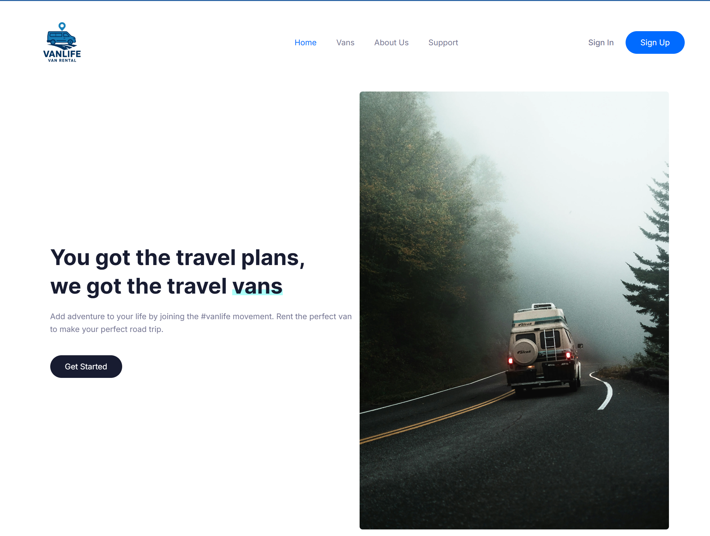

# Van Life 🚐

A full-stack web application for booking premium van rentals, featuring seamless authentication, payments, and a responsive user experience.

**🚀 [View Live Demo](https://van-life-dusky.vercel.app/)** 

## 🌟 Overview

Van Life is a comprehensive van rental platform built with Next.js 15, TypeScript, Tailwind CSS, and Prisma. The application provides a seamless experience for users to browse, book, and manage van rentals, with robust authentication and secure payment processing via Stripe.

## ✨ Features

- **Advanced Authentication System** using Next-Auth v5 with credentials and OAuth providers
- **Secure Payment Processing** with Stripe integration 
- **Responsive Design** optimized for all device sizes
- **Full-featured Booking System** with availability management
- **User Dashboard** for managing bookings and account details
- **Real-time Data Updates** with server actions and revalidation
- **Comprehensive Search and Filter** capabilities for finding the perfect van

## 🛠️ Technology Stack

- **Frontend**:
  - Next.js 15 (App Router)
  - React 19
  - TypeScript
  - Tailwind CSS

- **Backend**:
  - Server Components & Server Actions
  - Next-Auth v5
  - Prisma ORM
  - PostgreSQL
  - Stripe API
  - Cloudinary for image storage

## 📋 Key Technical Achievements

- **Implemented Secure Authentication**: Built a robust authentication system with Next-Auth v5, including credential and OAuth providers, secure session management, and role-based access control.

- **Integrated Stripe Payment**: Created a secure payment flow with real-time payment status updates and receipt generation.

- **Optimized Database Architecture**: Designed an efficient relational database schema using Prisma ORM.

- **Built Responsive UI**: Developed a fully responsive user interface that works seamlessly across mobile, tablet, and desktop devices, using Tailwind CSS for consistent styling.

- **Implemented Server-side Rendering**: Utilized Next.js server components for improved SEO and initial page load performance.

- **Created Booking Logic**: Developed complex availability checking and booking management system with real-time updates.

## 🔒 Authentication

- **Public users**: Can browse vans and view details
- **Authenticated users**: Can book vans, manage bookings, and update profiles

##  📄 License
This project is licensed under the MIT License - see the [LICENSE](./LICENSE) file for details.

